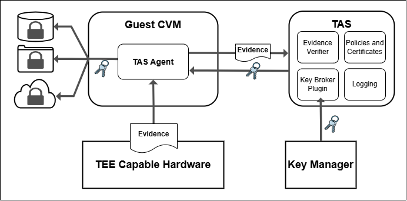

> ### This software is experimental and upcoming changes will break existing implementations. See [Upcoming Changes](#upcoming-changes) for more details.

# TEE Attestation Service (TAS)

A simple and secure service for Trusted Execution Environment (TEE) attestation, including key distribution, customisable policies and logging.

## Table of Contents

- [Overview](#overview)
- [Quick Start](#quick-start)
- [Prerequisites](#prerequisites)
- [Installation](#installation)
- [Configuration](#configuration)
- [API Documentation](#api-documentation)
- [KBM Plugins](#kbm-plugins)
- [Development](#development)
- [Upcoming Changes](#upcoming-changes)
- [Troubleshooting](#troubleshooting)

## Overview
TAS is a simple attestation service that verifies attestation evidence generated by TEEs. The standard deployment for TAS is as a service, to validate incoming evidence from booting confidential virtual machines (CVM), and after successful validation to provide a key to unlock the root file system of the CVM. This same process can be applied to unlocking anything, from access to data stores to identites on encrypted networks. You can also simply use the service to take in, verify, and log CVM attestation evidence at any point in the virtual machine's lifecycle.

TAS provides:
- **TEE Attestation**: Validates AMD SEV-SNP (and soon Intel TDX attestation) evidence
- **Key Management**: Secure key retrieval with cryptographic nonce validation
- **Policy Management**: Store and validate security policies for attestation
- **Pluggable Architecture**: Support for multiple Key Broker Modules (KBM)



## Quick Start

To get TAS running in 5 minutes we recommend using a python virtual environment:

```bash
# 1. Clone and setup
git clone https://github.com/TEE-Attestation/TAS
cd tas
# Install SNP tools (required for AMD SEV-SNP support)
python -m venv venv
source venv/bin/activate

# 2. Install dependencies
git clone https://github.com/TEE-Attestation/snp_pytools.git
cd snp_pytools
pip install .
cd ..
pip install -r requirements.txt

# 3. Start Redis (required)
redis-server &

# 4. Set environment variables
export TAS_API_KEY="your-64-character-api-key-here-make-it-secure-and-long-enough"
export TAS_KBM_PLUGIN="tas_kbm_mock"  # Use mock plugin for testing

# 5. Create and sign TAS policy
cd certs/policy/
# Using demo signer with auto-generated keys. To generate your own keys, refer https://github.com/TEE-Attestation/tas/blob/main/docs/POLICY.md
python3 demo_signer.py ./example_policy.json
# Add signature to your policy
jq -s '.[0] * .[1]' example_policy.json example_policy.json.sig > example_policy_signed.json
cd ../..

# 6. Run TAS
python app.py
```

TAS will be available at `http://localhost:5000`. See [API Documentation](#api-documentation) for available endpoints.

## Prerequisites


### Required Software

- **Python***
- **Redis**

*If you want to use the KMIP KBM plugin, ensure PyKMIP is installed. Note that PyKMIP does not work on Python 3.12 or later because it relies on ssl.wrap_socket(), which was removed in Python 3.12, so your venv will need a Python version between 3.7 and 3.11.

### Verify Prerequisites

```bash
# Check Python installation
python --version
# For KMIP should show: Python 3.7.x - 3.11.x

# Check Redis connectivity
redis-cli ping
# Should respond: PONG
```

### Platform Support

- **AMD SEV-SNP**: Full attestation support
- **Intel TDX**: (TODO) Full attestation support  

## Installation

### 1. Environment Setup

```bash
# Clone repository
git clone https://github.com/TEE-Attestation/TAS
cd tas

# Create Python virtual environment
python -m venv venv
source venv/bin/activate
```

### 2. Install Dependencies

```bash
# Install TAS dependencies
pip install -r requirements.txt

# Install SNP tools (required for AMD SEV-SNP support)
git clone https://github.com/TEE-Attestation/snp_pytools.git
cd snp_pytools
pip install .
cd ..
```

### 3. Configuration Setup

#### Option A: Quick Setup (Mock KBM)
```bash
export TAS_API_KEY="$(openssl rand -hex 32)"  # Generate secure API key
export TAS_KBM_PLUGIN="tas_kbm_mock"
echo "secrets:\n  test-key-1: test-secret-value" > config/mock_secrets.yaml
export TAS_KBM_CONFIG_FILE="config/mock_secrets.yaml"
```

#### Option B: Production Setup (KMIP KBM)
```bash
export TAS_API_KEY="$(openssl rand -hex 32)"  # Generate secure API key
export TAS_KBM_PLUGIN="tas_kbm_kmip"
export TAS_KBM_CONFIG_FILE="./config/pykmip/pykmip.conf"

# Configure PyKMIP credentials in config/pykmip/
# See docs/CONFIG.md for detailed configuration options
```

### 4. Running TAS

#### Option A: Run the TAS REST Server via HTTP
Use the flask run command, e.g.:

```bash
(venv) ~/tas$ flask run -h X.X.X.X -p 5000
TAS-KBM: Successfully connected to the KMIP server.
 * Debug mode: off
WARNING: This is a development server. Do not use it in a production deployment. Use a production WSGI server instead.
 * Running on http://X.X.X.X:5000
Press CTRL+C to quit
```

#### Option B: Run the TAS REST Server via HTTPS
Use the flask run command, e.g.:

```bash
(venv) ~/tas$ flask run -h X.X.X.X -p 5000 ---cert=path/to/cert.pem --key=config/tas_server.key
TAS-KBM: Successfully connected to the KMIP server.
* Debug mode: off
WARNING: This is a development server. Do not use it in a production deployment. Use a production WSGI server instead.
* Running on https://X.X.X.X:5000
Press CTRL+C to quit
```

#### Option C: Run the TAS REST Server via gunicorn

```bash
(venv) ~/tas$ gunicorn -w 4 -b X.X.X.X:5000 app:app
[2025-05-13 05:12:43 -0600] [3085265] [INFO] Starting gunicorn 23.0.0
[2025-05-13 05:12:43 -0600] [3085265] [INFO] Listening at: http://X.X.X.X:5000
[2025-05-13 05:12:43 -0600] [3085265] [INFO] Using worker: sync
[2025-05-13 05:12:43 -0600] [3085268] [INFO] Booting worker with pid: 3085268
[2025-05-13 05:12:44 -0600] [3085269] [INFO] Booting worker with pid: 3085269
[2025-05-13 05:12:44 -0600] [3085270] [INFO] Booting worker with pid: 3085270
[2025-05-13 05:12:44 -0600] [3085271] [INFO] Booting worker with pid: 3085271
TAS: Successful Connection to Redis Server
TAS-KBM: Successfully connected to the KMIP server.
TAS: Successful Connection to Redis Server
TAS-KBM: Successfully connected to the KMIP server.
TAS: Successful Connection to Redis Server
TAS: Successful Connection to Redis Server
TAS-KBM: Successfully connected to the KMIP server.
TAS-KBM: Successfully connected to the KMIP server.
```

#### Option D: Run the TAS REST Server via HTTPS in a production mode

This mode requires the use of Nginx as a reverse-proxy, to sit in front of the TEE Attestation Service.

1) Install Nginx
2) Setup the SSL/TLS Certificates
    Place the private key and certificate in a secure directory, (e.g., `/etc/nginx/ssl/`).

    ```bash
    (venv) ~/tas$ sudo mkdir /etc/nginx/ssl
    (venv) ~/tas$ sudo cp config/tas_server.key /etc/nginx/ssl
    (venv) ~/tas$ sudo cp config/cert.pem /etc/nginx/ssl
    (venv) ~/tas$ sudo systemctl reload nginx
    ```

3) Configure the required instance(s) of TAS.
   Create or edit the Nginx configuration file (e.g., `/etc/nginx/sites-available/tas`):

    ```nginx
    server {
        listen 6000 ssl;
        server_name X.X.X.X;

        # SSL/TLS configuration: Thales CTM
        ssl_certificate /etc/nginx/ssl/cert.pem;
        ssl_certificate_key /etc/nginx/ssl/tas_server.key;

        # Proxy settings
        location /tas_customer1/ {
                proxy_pass http://127.0.0.1:5000/;
                proxy_set_header Host $host;
                proxy_set_header X-Real-IP $remote_addr;
                proxy_set_header X-Forwarded-For $proxy_add_x_forwarded_for;
        }

    }
    ```

4) Reload Nginx

   ```bash
    (venv) ~/tas$ sudo systemctl reload nginx
    ```

5) Run the TAS REST Server on the required localhost port

    ```bash
    (venv) ~/tas$ gunicorn -w 4 -b localhost:5000 app:app
    [2025-05-13 06:25:30 -0600] [3146615] [INFO] Starting gunicorn 23.0.0
    [2025-05-13 06:25:30 -0600] [3146615] [INFO] Listening at: http://127.0.0.1:5000 (3146615)
    [2025-05-13 06:25:30 -0600] [3146615] [INFO] Using worker: sync
    [2025-05-13 06:25:30 -0600] [3146618] [INFO] Booting worker with pid: 3146618
    [2025-05-13 06:25:30 -0600] [3146619] [INFO] Booting worker with pid: 3146619
    [2025-05-13 06:25:30 -0600] [3146620] [INFO] Booting worker with pid: 3146620
    [2025-05-13 06:25:30 -0600] [3146621] [INFO] Booting worker with pid: 3146621
    TAS: Successful Connection to Redis Server
    TAS: Successful Connection to Redis Server
    TAS-KBM: Successfully connected to the KMIP server.
    TAS-KBM: Successfully connected to the KMIP server.
    TAS: Successful Connection to Redis Server
    TAS-KBM: Successfully connected to the KMIP server.
    TAS: Successful Connection to Redis Server
    TAS-KBM: Successfully connected to the KMIP server.
    ```

6) Ensure the TAS KBM Client application uses the correct URI.
    For above example:
        TAS_SERVER_URI=https://X.X.X.X:6000/tas_customer1

## Configuration

TAS uses a flexible configuration system supporting environment variables and YAML/JSON files.

### Required Environment Variables

```bash
# Minimum required configuration
export TAS_API_KEY="your-secure-64-character-minimum-api-key-here"
export TAS_KBM_PLUGIN="tas_kbm_mock"  # or "tas_kbm_kmip"
```

### Complete Configuration Example

```bash
# Core settings
export TAS_API_KEY="your-production-api-key-must-be-64-characters-minimum"
export TAS_KBM_PLUGIN="tas_kbm_kmip"
export TAS_KBM_CONFIG_FILE="./config/pykmip/pykmip.conf"

# Optional settings
export TAS_REDIS_HOST="localhost"
export TAS_REDIS_PORT="6379"
export TAS_NONCE_EXPIRATION_SECONDS="300"
export TAS_PLUGIN_PREFIX="tas_kbm"
export TAS_EXTRA_PLUGIN_DIR="/opt/tas/plugins"

# Logging configuration
export TAS_OVERRIDE__logging__level="INFO"
export TAS_OVERRIDE__logging__file="/var/log/tas.log"
```

**Detailed Configuration**: See [docs/CONFIG.md](docs/CONFIG.md) for complete configuration options, file formats, and environment variable precedence.

## When TAS is Running

### Service Verification

```bash
# Check TAS is running
curl -H "X-API-KEY: your-api-key" http://localhost:5000/version

# Expected response:
# {"version": "0.1.0"}
```

## API Documentation

### Core Endpoints

| Endpoint | Method | Description |
|----------|--------|-------------|
| `/kb/v0/get_nonce` | GET | Generate attestation nonce |
| `/kb/v0/get_secret` | POST | Retrieve secret after TEE verification |
| `/policy/v0/store` | POST | Store security policy |
| `/policy/v0/get/<key>` | GET | Retrieve security policy |
| `/policy/v0/list` | GET | List all policies |
| `/policy/v0/delete/<key>` | DELETE | Delete security policy |
| `/version` | GET | Get TAS version |

### Authentication

All endpoints require API key authentication:
```bash
curl -H "X-API-KEY: your-api-key" <endpoint>
```

### Example API Usage

#### 1. Get Nonce
```bash
curl -H "X-API-KEY: your-api-key" \
  http://localhost:5000/kb/v0/get_nonce
```

#### 2. Request Secret
```bash
curl -X POST \
  -H "Content-Type: application/json" \
  -H "X-API-KEY: your-api-key" \
  -d '{
    "tee-type": "amd-sev-snp",
    "nonce": "obtained-from-get-nonce",
    "tee-evidence": "base64-encoded-attestation-report",
    "key-id": "my-secret-key",
    "wrapping-key": "base64-encoded-public-key"
  }' \
  http://localhost:5000/kb/v0/get_secret
```

#### 3. Store Policy
```bash
curl -X POST \
  -H "Content-Type: application/json" \
  -H "X-API-KEY: your-api-key" \
  -d '{
    "policy_type": "SNP",
    "policy_identifier": "my-policy-hash",
    "policy": {
      "metadata": {"name": "Test Policy", "version": "1.0"},
      "signature": {...},
      "validation_rules": {
        "measurement": {"exact_match": "abc123"},
        "debug": false
      }
    }
  }' \
  http://localhost:5000/policy/v0/store
```

**Complete API Documentation**: See [docs/openapi.yaml](docs/openapi.yaml) and [docs/openapi.json](docs/openapi.json) files

**Detailed Configuration**: See [docs/POLICY.md](docs/POLICY.md) for documentation on policy structure, signing, and uploading.


## KBM Plugins

TAS supports pluggable Key Broker Modules (KBM) for different backend key management systems.

### Available Plugins

| Plugin | Description | Use Case |
|--------|-------------|----------|
| `tas_kbm_kmip` | KMIP protocol backend | Production with KMIP servers (Thales, etc.) |
| `tas_kbm_mock` | Software-based mock | Development and testing |

### Plugin Interface

Each KBM plugin must implement three functions:

```python
def kbm_open_client_connection(config_file: str = None):
    """Initialize and return a client handle"""
    
def kbm_get_secret(client, key_id: str, wrapping_key: bytes):
    """Retrieve and return a secret (JSON-serializable)"""
    
def kbm_close_client_connection(client) -> None:
    """Cleanup client connection"""
```

### Plugin Configuration

#### KMIP Plugin
```bash
export TAS_KBM_PLUGIN="tas_kbm_kmip"
export TAS_KBM_CONFIG_FILE="./config/pykmip/pykmip.conf"
```

The PyKMIP configuration file should contain KMIP server details and credentials.

#### Mock Plugin
```bash
export TAS_KBM_PLUGIN="tas_kbm_mock"
export TAS_KBM_CONFIG_FILE="./config/mock_secrets.yaml"
```

Example mock configuration file:
```yaml
secrets:
  test-key-1: "test-secret-value"
  another-key: "another-secret"
```

### Creating Custom Plugins

1. Create a Python module in `plugins/` directory
2. Module name must start with `TAS_PLUGIN_PREFIX` (default: `tas_kbm`)
3. Implement the three required functions
4. Set `TAS_KBM_PLUGIN` to your module name

Example custom plugin:
```python
# plugins/tas_kbm_custom.py

def kbm_open_client_connection(config_file: str = None):
    # Initialize your backend client
    return my_backend_client

def kbm_get_secret(client, key_id: str, wrapping_key: bytes):
    # Retrieve secret from your backend
    # Wrap with provided public key
    return wrapped_secret

def kbm_close_client_connection(client) -> None:
    # Cleanup
    client.disconnect()

__all__ = [
    "kbm_open_client_connection",
    "kbm_get_secret", 
    "kbm_close_client_connection"
]
```

### Plugin Discovery

- **Default search path**: `./plugins/`
- **Additional search path**: Set `TAS_EXTRA_PLUGIN_DIR`
- **Plugin selection**: Set `TAS_KBM_PLUGIN` to module name


## Development

### Running Tests

```bash
# Run all tests
python -m pytest tests/ -v

# Run specific test file
python -m pytest tests/test_policy_helper.py -v

# Run with coverage
python -m pytest tests/ --cov=tas --cov-report=html
```

## Upcoming Changes

 - AES-CGC -> AES-GCM
 - Add RSA key to TEE report data
 - Support for Intel TDX

## Troubleshooting

### Redis Connection Failed
```
Error: Failed to connect to the Redis server
```
**Solution**: Ensure Redis is running on the configured host/port
```bash
redis-server &  # Start Redis
redis-cli ping  # Test connectivity
```

### API Key Error
```
Error: TAS_API_KEY environment variable is not set
```
**Solution**: Set a secure API key (minimum 64 characters)
```bash
export TAS_API_KEY="$(openssl rand -hex 32)"
```

### KMIP Connection Issues
```
Error: Failed to initialize KBM client
```
**Solutions**:
- Check PyKMIP configuration file exists and is valid
- Verify KMIP server connectivity
- Use mock plugin for testing: `export TAS_KBM_PLUGIN=tas_kbm_mock`

### Python Version Compatibility
```
Error: ssl.wrap_socket() removed in Python 3.12
```
**Solution**: Use Python 3.7-3.11. PyKMIP doesn't support Python 3.12+

### Debug Mode

Enable detailed logging:
```bash
export TAS_OVERRIDE__logging__level="DEBUG"
python app.py
```

### Health Checks

```bash
# Basic connectivity
curl -H "X-API-KEY: your-key" http://localhost:5000/version

# Redis connectivity
redis-cli ping

# Check TAS logs
tail -f tas.log
```

### Getting Help

- **Issues**: Open an issue on the repository

---

## License

This project is licensed under the MIT license. See LICENSE file for details.